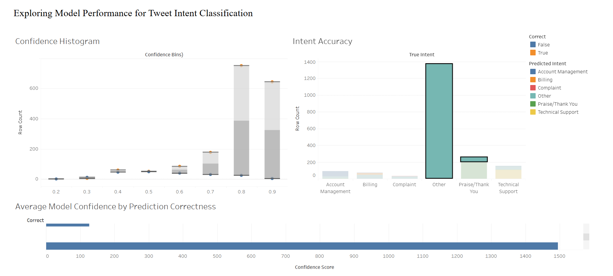

# Tweet Intent Classification Project

This project explores predicting customer support intent from tweets using machine learning. The goal is to build a model that accurately classifies tweet intents such as billing issues, complaints, or praise — helping improve automated customer support systems and agent triage.

## Dataset

The analysis uses a manually labeled "golden set" of tweets, containing ~300 examples with clear intent labels. This curated subset was chosen to ensure reliable evaluation, even though the full dataset includes thousands of unlabeled tweets.

## Approach

I started with a baseline model using TF-IDF vectorization to capture important words and phrases in each tweet. I then explored the impact of additional features:

- **Tweet length** (character count)  
- **Is the tweet a question?** (binary feature)  
- **Sentiment score** (numeric polarity from text sentiment analysis)

Each model was trained using logistic regression and evaluated with macro F1 scores to balance performance across all intent categories.

## Tableau Dashboard 

- View Dashboard in Tableau Public here: https://public.tableau.com/views/TweetIntentClassificationAnalysis/Dashboard1?:language=en-US&:sid=&:redirect=auth&:display_count=n&:origin=viz_share_link
- Dashboard Preview:

## Conclusion & Next Steps

This project shows that simple features like sentiment can meaningfully improve intent classification, especially for emotionally charged tweets. While TF-IDF is a solid baseline, future improvements could include:

- Expanding the labeled dataset
- Engineering more domain-specific features
- Incorporating contextual embeddings (e.g., **BERT**) to capture deeper meaning and nuance

This would especially help for ambiguous or sarcastic tweets where tone and word order matter.

## Author  
Vincent Shipley
